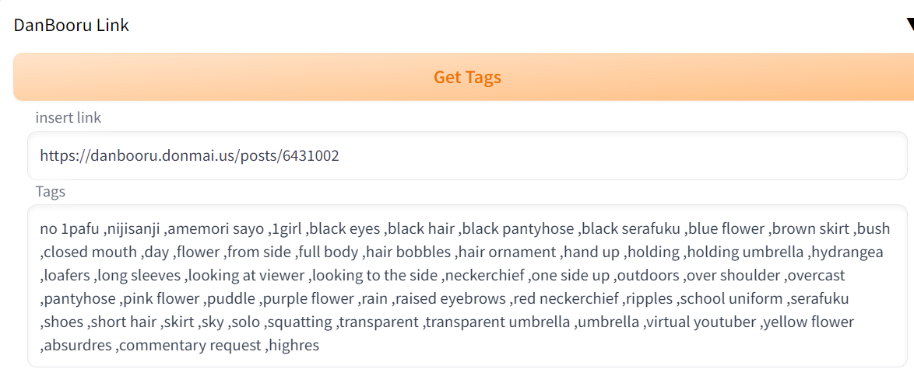

# Danbooru Prompt
Extension that gets tags for Danbooru images links in AUTOMATIC1111's Stable Diffusion webui

# Credit:
Alot of code I used for this project came from this project:
https://github.com/antis0007/sd-webui-gelbooru-prompt

## What is this?
This is a small extension I wrote to let you automatically pull the tags for any saved Danbooru image link in [AUTOMATIC1111's stable-diffusion-webui](https://github.com/AUTOMATIC1111/stable-diffusion-webui)

## Additional Info:

### How does this work?

Example:
> paste  Danbooru image link : https://danbooru.donmai.us/posts/6431002

All you need to do is hit the "Get Tags" button, and it will put the fetched tags into the textbox below.

You can now use these tags in any prompt crafting you'd like to do. Enjoy!

### Requirements:
This extensions requires beautifulsoup4, you'll need to install it to either your venv or globally depending on your setup

[inside venv/Scripts]
yourenv is where  your stable webui is installed
> activate yourenv 

> pip install beautifulsoup4

## Showcase / Usage:

